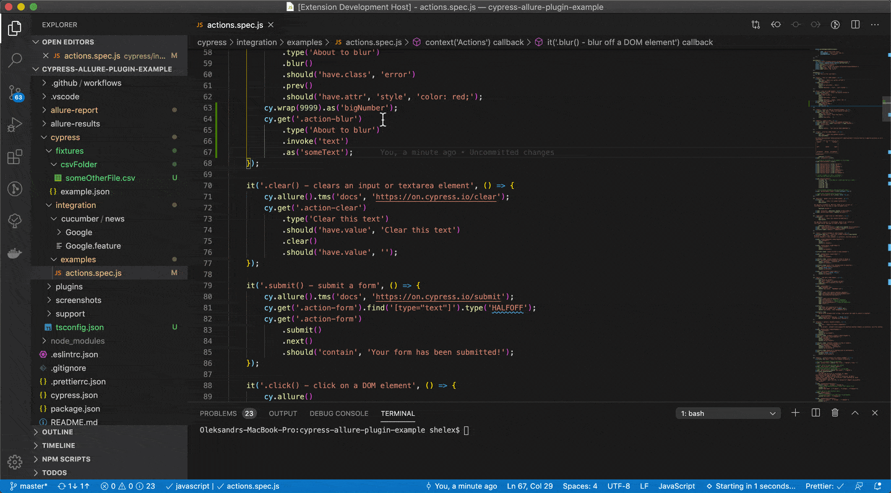

### Alias autocompletion

Autocompletion for aliases. Aliases will be selected from files in current folder.

### Alias definition

Go to definition and Peek definition options available for aliases.  
Aliases created in same folder files are supported only.

