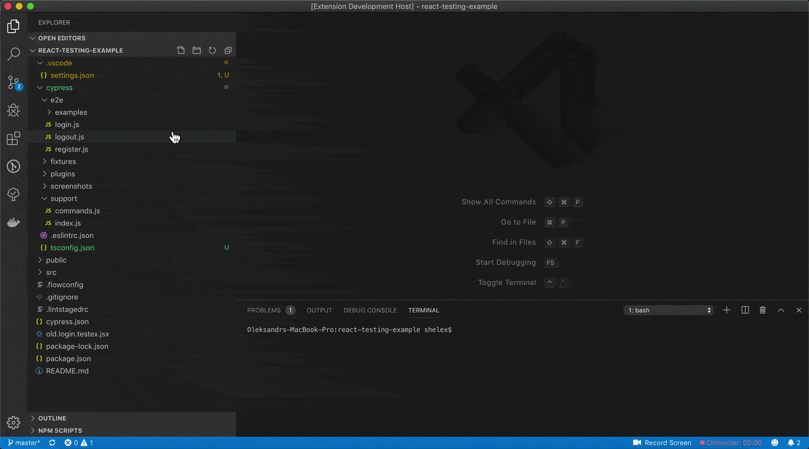
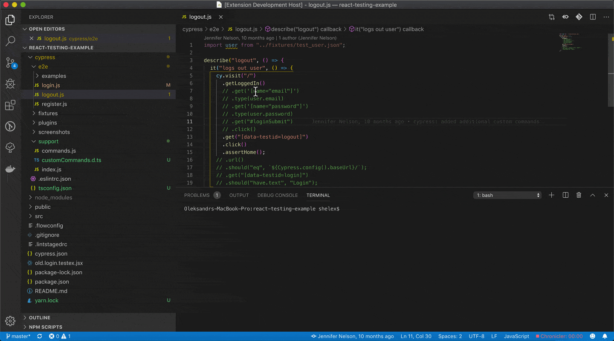
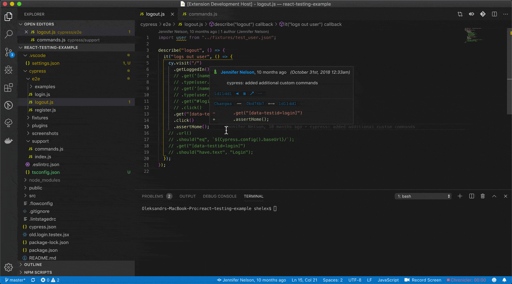

### Open cypress custom command definition

In case you want to be instantly redirected to definition file - click on custom command, and from editor menu select `Cypress: Go to custom command definition`  
You can use native `Go to Definition` and `Peek Definition` - but usually it offers several results, so you should pick one by yourself.  
If you are using just native editor menu items - you can disable `Cypress: Go to custom command definition` in configuration `cypressHelper.menuItems` by setting `"GoToCustomCommand": false`  
How it works:

-   Text from current line with cursor is taken, trying to find closest command call in line;
-   Checking files in `cypressHelper.customCommandsFolder` (`cypress/support` by default).
-   In case file with `Cypress.Commands.add(%%detected_command%%)` is found - redirect.

### Find Cypress custom commands references

From editor menu select `Cypress: Get custom command references` to choose from quick-pick menu or you can use native `Find All References` and `Peek References` to use left-panel tab.  
You can disable editor `Cypress: Get custom command references` item with configuration `cypressHelper.menuItems` and `"FindCustomCommandReferences": false`.  
In case you have custom command `.ts` definition file in your workspace - native methods will return duplicated results, so you can turn off extension references provider with configuration `cypressHelper.enableCommandReferenceProvider: false`.

### Find unused Cypress custom commands

From command palette (⌘P) select `Cypress: Find not used custom commands`

### Generate type definitions for Cypress custom commands

Context menu item `Cypress: Generate custom command types` or can also be configured to generate types on save, with `cypressHelper.typeDefinitionOnSave`  
How it works:

-   checks configuration `customCommandsFolder`, `typeDefinitionFile`, `typeDefinitionExcludePatterns`, `includeAnnotationForCommands`
-   get files from `customCommandsFolder`, excepting `typeDefinitionExcludePatterns`
-   in case custom command definitions found - trying to parse argument types, setting `any` by default
-   get `typeDefinitionFile` content to check how much commands changed to display message
-   check for command names duplication (2 commands with same name will cause inappropriate behaviour)
-   write file with type definitions for commands to `typeDefinitionFile`, in case `includeAnnotationForCommands: true` also includes comment above commands. **Please note** that comment should be in [JSDoc](https://code.visualstudio.com/docs/languages/javascript#_jsdoc-support) format (`/**`), in other case only last comment is added.
-   in case workspace has no `tsconfig.json` file, prompt to create it will be shown.
-   show message about duplicates, added and deleted commands.

### Create default tsconfig file

If you are using generating type definition plugin will ask you if you want to create tsconfig file automatically.
However, it is possible to create it with separate command:

From command palette select command `Cypress: Create default tsconfig.json file`
tsconfig could also be created when `Cypress: Generate custom command types` is used.