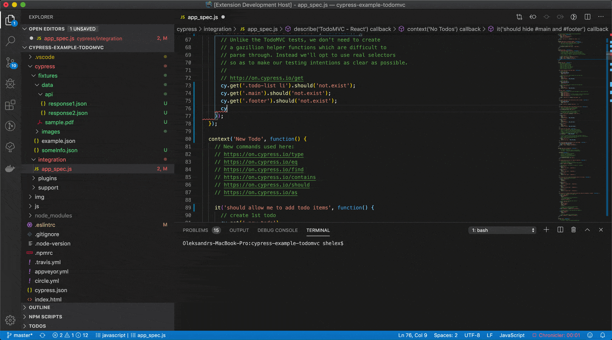

### Fixtures autocompletion

Typing `cy.fixture(` opens VS Code Completion interface with possible files and subfolders to select needed fixture file  
To add your own commands that require fixture autocomplete for arguments - check configuration `cypressHelper.fixtureAutocompletionCommands`  
If you are using cucumber and fixtures as parameters in your scenarios, you can enable autocomplete by setting `cypressHelper.cucumberFixtureAutocompleteOnQuotes: true`  
Thanks to [Josef Biehler](https://github.com/gabbersepp/cypress-fixture-intellisense) for original fixture autocomplete idea

### Fixtures definition

Go to definition and Peek definition options for feature files.  
Works in cucumber feature files in scenario or examples table also.  
Currently default fixtures path `cypress/fixtures` supported only.

