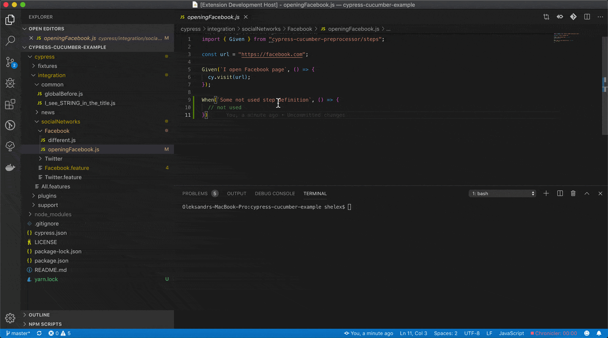
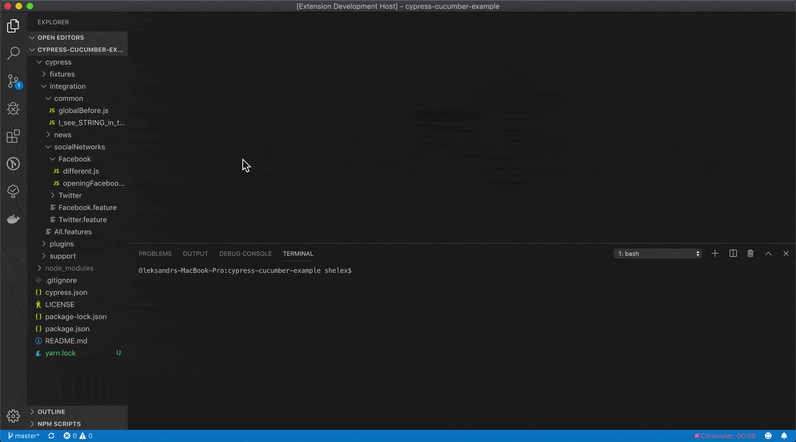
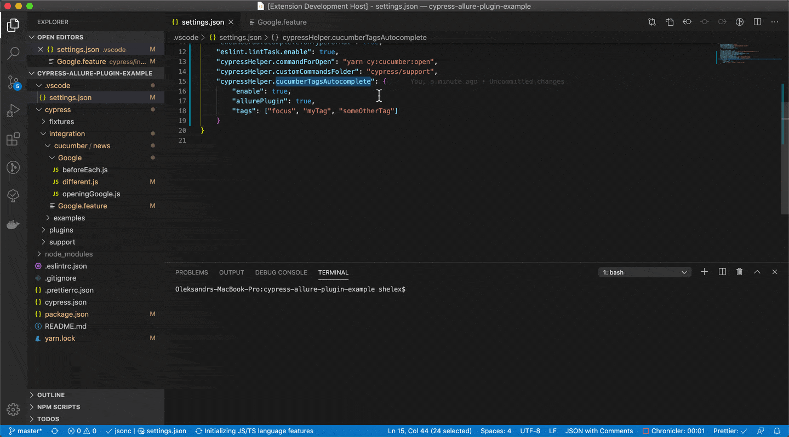

### Find Cucumber step definition references

From menu select `Cypress: Get step definition references` to choose from quick-pick menu or you can use native `Find All References` and `Peek References` to use left-panel tab.

### Find unused Cucumber step definitions

From command palette select command `Cypress: Find not used Cucumber step definitions`

### Tags autocompletion

Typing `@` in `.feature` file shows autocompletion with tags from configuration `cypressHelper.cucumberTagsAutocomplete.tags` - with `focus` by default. In case you have [cypress-allure-plugin](https://www.npmjs.com/package/@shelex/cypress-allure-plugin) just set `cypressHelper.cucumberTagsAutocomplete.allurePlugin` and list of allure tags will be available.

